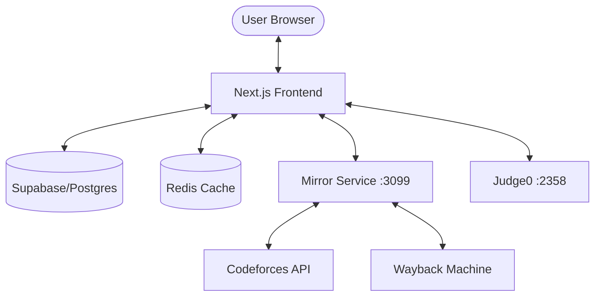

# Verdict Architecture Overview

This document is designed to help AI agents quickly understand how the Verdict system components interact.

## 🗺️ System Map

## 📂 Key Components & Responsibilities

| Directory/File | Responsibility |
| :--- | :--- |
| `src/app/api` | Backend API routes (Auth, Judge, Solutions) |
| `src/lib/solutions.ts` | The core logic for fetching accepted solutions from Wayback. |
| `src/components/mirror/ai` | AI Tutor and Agent Panel logic / prompts. |
| `src/contexts/AuthContext.tsx` | JWT-based session management. |
| `scripts/vcl` | Developer helper CLI. |

## 🛠️ Data Flows
1.  **Code Execution**: Frontend -> `/api/judge/run` -> Judge0 Server -> Result back to UI.
2.  **Solution Fetching**: Frontend -> `/api/solutions/fetch` -> `solutions.ts` -> CF/Wayback -> Reference Logic.
3.  **Authentication**: Supabase Redirect -> `/api/auth/callback` (JWT sign) -> `/problemsets`.
